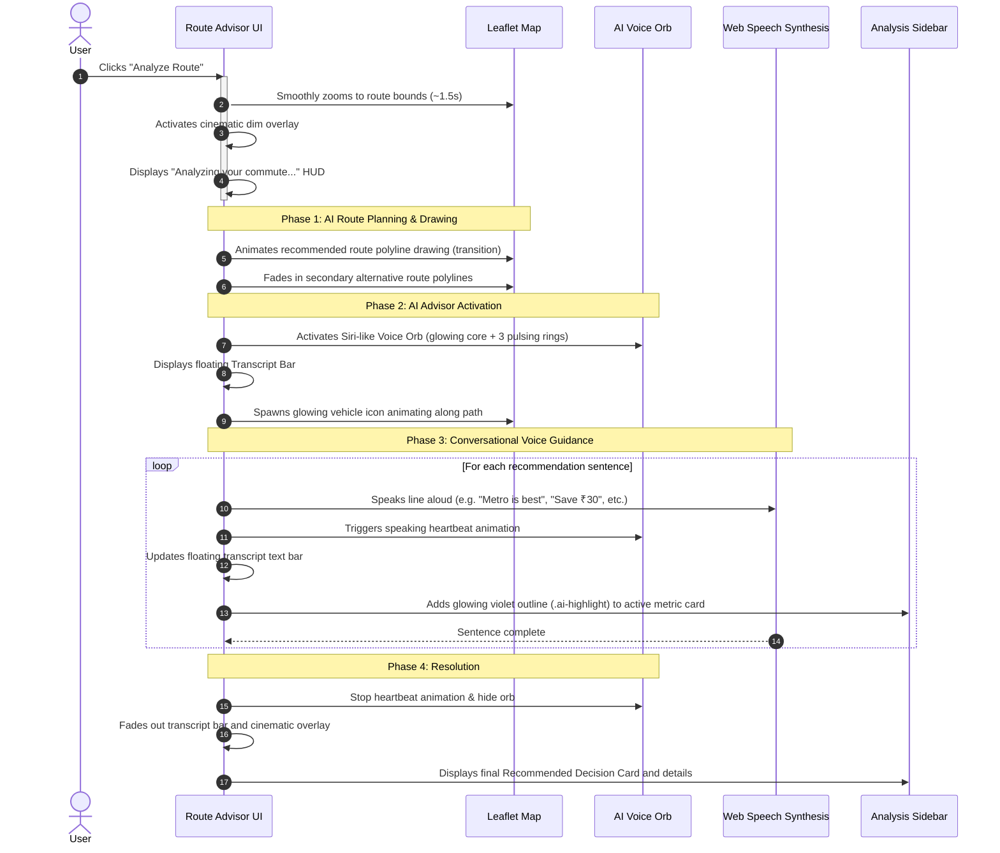

<p align="center">
  
  
  
  
</p>

<h1 align="center">🧭 NOMAD</h1>
<h3 align="center"><em>Every commute. Optimized for you.</em></h3>

<p align="center">
  A next-generation <strong>Mobility Operating System</strong> that learns how you travel and recommends the best transportation decisions based on <strong>time</strong>, <strong>cost</strong>, <strong>safety</strong>, and <strong>environmental impact</strong>.
</p>

---

## 📋 Table of Contents

- [Overview](#-overview)
- [Key Features](#-key-features)
- [Live Demo](#-live-demo)
- [Tech Stack](#-tech-stack)
- [Getting Started](#-getting-started)
- [Project Structure](#-project-structure)
- [Pages & Modules](#-pages--modules)
- [Eco Points & Marketplace](#-eco-points--marketplace)
- [AI Mobility Advisor Experience](#-ai-mobility-advisor-experience)
- [Design Philosophy](#-design-philosophy)
- [Screenshots](#-screenshots)
- [Contributing](#-contributing)
- [License](#-license)

---

## 🌍 Overview

NOMAD is a premium web application designed to transform urban commuting across Indian cities. It provides **intelligent multi-modal route planning** that factors in real-time transit schedules, traffic conditions, weather, air quality, and carbon emissions — delivering personalized commute recommendations through a beautiful, data-driven interface.

The platform includes:
- A **landing page** with a live interactive map and route demo
- A **Route Advisor Workspace** (commute planner between two locations)
- A **mobile-first app mockup** simulating a real smartphone navigation experience
- A **Travel Profile dashboard** tracking commuting patterns and eco impact
- A **Government Artisan Marketplace** for redeeming earned eco points

---

## ✨ Key Features

### 🗺️ Intelligent Route Planning
- Multi-modal routing: Metro, E-Bike, Auto-rickshaw, Bus, Cab, Walking
- Real-time route analysis across **Time**, **Cost**, **Safety**, and **Environmental** perspectives
- AI-powered recommendation engine that weighs all four factors to suggest the optimal commute
- Place autocomplete with geocoding for Indian city landmarks

### 📊 Commuter Analytics Dashboard
- Monthly commuting statistics — trips, distance, time, money spent
- Transport mode distribution (donut chart) — Metro, E-Bike, Auto, Bus, Cab, Walk
- Weekly trend line chart with interactive tooltips
- Commute emissions comparison (Car vs. NOMAD) with animated bar visualization

### 📱 Mobile-First App Experience
- Pixel-perfect smartphone mockup with notch, status bar, and rounded corners
- Bottom-sheet navigation (drag-up route planner like Google Maps)
- 4-tab navigation: **Home** (map), **Trips** (saved routes), **Insights** (analytics), **Profile** (eco points)
- Follows Apple HIG and Google Material 3 design principles
- One-hand operable interface

### 🌿 Eco Points Reward System
- **1 kg CO₂ saved = 1 Eco Point** earned automatically
- Points balance persisted across all pages via `sessionStorage`
- Redeemable at the **Maha Eco-Bazaar** government artisan marketplace

### 🏛️ Maha Eco-Bazaar (Government Marketplace)
- Authentic Indian government portal aesthetic (NIC/GeM style)
- Tricolor stripe, Ashoka emblem, Hindi department header
- 6 artisan products sourced from Maharashtra rural cooperatives and tribal SHGs
- Government-style order receipts with official reference numbers
- Product categories: Handlooms, Artisan Crafts, Organic Foods, Tribal Art

### 🎙️ AI Mobility Advisor Experience
- Cinematic voice assistant sequence triggered when analyzing a route
- Siri-like pulsing voice orb (gradient core + 3 pulsing rings) reacting dynamically to speech
- Text-to-speech voice narration (via Web Speech API) synced with a floating transcript bar
- Step-by-step map path highlighting and perspective card glow animations matching voice descriptions

### 🎨 Premium Design
- Light / Dark theme toggle with smooth transitions
- Glassmorphism effects, gradient cards, and micro-animations
- Leaflet maps with theme-aware tile layers (CartoDB Voyager / Dark Matter)
- Responsive design that works across desktop and tablet viewports
- Custom CSS design system with consistent tokens and variables

---

## 🚀 Live Demo

> After cloning and starting the dev server, navigate to:

| Page | URL | Description |
|------|-----|-------------|
| **Landing Page** | `http://localhost:5173/` | Hero with interactive map demo |
| **Route Planner** | `http://localhost:5173/planner.html` | Full commute advisor workspace |
| **Mobile App** | `http://localhost:5173/app.html` | Smartphone mockup experience |
| **Travel Profile** | `http://localhost:5173/profile.html` | Analytics dashboard & eco stats |
| **Eco Marketplace** | `http://localhost:5173/marketplace.html` | Government artisan redemption portal |

---

## 🛠️ Tech Stack

| Technology | Purpose |
|------------|---------|
| **HTML5** | Semantic markup and page structure |
| **Vanilla CSS** | Custom design system with CSS variables, gradients, and animations |
| **Vanilla JavaScript (ES Modules)** | Application logic, DOM manipulation, state management |
| **Vite 5** | Dev server, hot module replacement, and production bundler |
| **Leaflet 1.9** | Interactive maps with multiple tile layers |
| **Lucide Icons** | Consistent vector iconography throughout the UI |
| **OpenStreetMap / Nominatim** | Geocoding and place search API |
| **CartoDB Tiles** | Map tile layers (Voyager for light, Dark Matter for dark theme) |

> **No frameworks.** The entire application is built with vanilla HTML, CSS, and JavaScript — no React, Vue, or Angular dependencies.

---

## ⚡ Getting Started

### Prerequisites

- **Node.js** ≥ 18.0
- **npm** ≥ 9.0

### Installation

```bash
# Clone the repository
git clone https://github.com/yourusername/nomad.git

# Navigate to project directory
cd nomad

# Install dependencies
npm install
```

### Development

```bash
# Start the Vite dev server with hot reload
npm run dev
```

The app will be available at `http://localhost:5173/`

### Production Build

```bash
# Build optimized production bundle
npm run build

# Preview the production build locally
npm run preview
```

The production output is generated in the `dist/` directory.

---

## 📁 Project Structure

```
Nomad/
├── index.html              # Landing page — hero, demo mode, features section
├── index.css               # Global design system — all CSS tokens, layouts, and components
├── app.js                  # Landing page controller — demo mode, theme toggle, scroll
├── app.html                # Mobile app mockup — smartphone frame with 4-tab navigation
├── main.js                 # Mobile app controller — maps, routing, sheets, charts, marketplace
├── planner.html            # Route Advisor Workspace — split-screen map + analysis panel
├── planner.js              # Planner controller — autocomplete, geocoding, route analysis
├── profile.html            # Travel Profile dashboard — stats, charts, eco impact cards
├── profile.js              # Profile controller — charts, theme toggle, points redirect
├── marketplace.html        # Maha Eco-Bazaar — government artisan marketplace portal
├── marketplace.js          # Marketplace controller — category filters, purchases, receipts
├── vite.config.js          # Vite build config — multi-page entry points
├── package.json            # Project metadata and npm scripts
├── eco_bazaar_hero.png     # Generated hero image for marketplace
└── dist/                   # Production build output (auto-generated)
```

---

## 📄 Pages & Modules

### 1. Landing Page (`index.html` + `app.js`)

The entry point of the application. Features:

- **Immersive map background** — Full-viewport Leaflet map centered on Bengaluru
- **Hero overlay** — "Every commute. Optimized for you." tagline with CTAs
- **Demo mode** — Click "See Demo" to reveal an interactive HUD with 3 route options (Metro, E-Bike, Cab), a status widget (vehicle link, air quality, temperature), and animated route polylines on the map
- **Features section** — Three benefit cards (Save Time, Save Money, Reduce Carbon)
- **Dark/Light theme toggle** — Persists across pages
- **Navigation** — Links to Travel Profile and Launch App

### 2. Route Advisor Workspace (`planner.html` + `planner.js`)

A full desktop commute planning workspace:

- **Split-screen layout** — 70% interactive map + 30% analysis sidebar
- **Origin/Destination inputs** — With live autocomplete powered by OpenStreetMap Nominatim API
- **Departure time selector** — Dynamically generated time slots from current time
- **"Analyze Route" button** — Triggers the cinematic AI Mobility Advisor sequence (see [AI Mobility Advisor Experience](#-ai-mobility-advisor-experience))
- **Four perspective cards** — Time, Cost, Safety, and Environmental analysis with contextual reasoning (highlighted dynamically in sync with the AI voice)
- **Recommended Decision card** — Final multi-factor recommendation with key metrics, displayed after the AI presentation finishes
- **Animated route polylines** — Drawn dynamically on the map in real-time as the advisor guides the commuter

### 3. Mobile App Mockup (`app.html` + `main.js`)

A pixel-perfect smartphone simulation rendered inside a phone frame:

- **Phone frame** — Earpiece notch, status bar with live clock, rounded corners
- **Home tab** — Live Leaflet map with a draggable bottom sheet containing origin/destination inputs, departure time, and route analysis results
- **Trips tab** — Saved/favorite routes (Mumbai Airport → BKC, Andheri → Powai, etc.) with quick-load functionality
- **Insights tab** — Full analytics dashboard:
  - Monthly stats grid (trips, distance, time, money)
  - Transport mode donut chart with percentage legend
  - Weekly trend sparkline chart with hover tooltips
  - Commute emissions comparison bar chart (Car vs. NOMAD)
- **Profile tab** — Eco Points balance, "Redeem at Maha Eco-Bazaar" button
- **Marketplace screen** — Compact government-themed product listing inside the phone viewport with order confirmation modals

### 4. Travel Profile (`profile.html` + `profile.js`)

A desktop analytics dashboard:

- **Hero header** — Mobility Insights header
- **Three stat cards** — Total Trips (142), CO₂ Saved (142 kg), Eco Points (142) with redeem link
- **Commuting preference cards** — Distance tolerance, peak hours, transport modes
- **Weekly trend chart** — 7-day trip pattern with data labels
- **Commute emissions comparison** — Animated side-by-side Car vs. NOMAD bars

### 5. Maha Eco-Bazaar (`marketplace.html` + `marketplace.js`)

A government-styled marketplace for redeeming Eco Points:

- **Authentic government UI** — Accessibility toolbar, tricolor stripe, Ashoka emblem, Hindi + English department header, NIC footer
- **Sidebar** — Live Eco Points balance, category filter (All / Handlooms / Crafts / Foods / Art), citizen helpline, important government links
- **Product listing** — Table-style rows with:
  - Product name, type tag, artisan/SHG name, district
  - Point cost and "Redeem" button
  - Automatic button disabling when balance is insufficient
- **Government receipt modal** — Official order confirmation with verification stamp, order details table, reference code (copied to clipboard), and helpline info

#### Products Available

| Product | Artisan / SHG | District | Points |
|---------|--------------|----------|--------|
| Handwoven Khadi Scarf | Savita Tai — Gramin Mahila Bachat Gat | Wardha | 60 |
| Gondia Bamboo Travel Bottle | Ramdas Mandavi — Gondia Forest Cooperative | Gondia | 40 |
| Dharavi Terracotta Water Pot | Kumbhar Potters Guild | Dharavi, Mumbai | 30 |
| Melghat Wild Forest Honey (500g) | Korku Tribal Farmers Union | Melghat, Amravati | 50 |
| Solapur Handwoven Cotton Tote Bag | Weavers Cooperative — Solapur Handloom Cluster | Solapur | 20 |
| Gadchiroli Dhokra Brass Oil Lamp | Gadiya Lohar Collective | Gadchiroli | 100 |

---

## 🌿 Eco Points & Marketplace

NOMAD's gamification layer incentivizes sustainable commuting:

```
Eco Points Formula:
1 kg CO₂ Saved = 1 Eco Point = ₹10 Equivalent Value
```

### How It Works

1. **Earn points** — Every time you choose a greener commute mode (Metro, E-Bike, Bus) over driving, the CO₂ difference is calculated and converted to Eco Points
2. **Track balance** — Your points are displayed on the Travel Profile and the mobile app's Profile tab
3. **Redeem** — Click "Redeem Points" to visit the Maha Eco-Bazaar government portal where you can exchange points for artisan crafts, handloom products, organic foods, and tribal art from verified Maharashtra rural cooperatives
4. **Receive confirmation** — A government-style order receipt with an official reference number is generated and copied to your clipboard

### State Management

Points are synchronized across all pages using `sessionStorage` with the key `nomad-eco-points`. This ensures a consistent balance whether you're on the profile page, mobile app, or marketplace.

---

## 🎙️ AI Mobility Advisor Experience

NOMAD features an **AI Mobility Advisor** built for a premium, cinematic user experience. When you plan a commute in the Route Advisor Workspace and click **"Analyze Route"**, the system orchestrates a synchronized sequence of map animations, text-to-speech audio guidance, and side-panel visual cues.



### The 7-Phase Cinematic Sequence

| Phase | Description | Visual / Audio Effect | Duration |
|-------|-------------|-----------------------|----------|
| **1. Map Zoom** | Focuses the map on the route corridor. | Leaflet map shifts smooth-bounds. | ~1.5s |
| **2. Cinematic Dimming** | Fades in a dark overlay to isolate map details. | `.ai-cinematic-overlay` radial gradient. | ~0.4s |
| **3. Deep Analysis** | Displays a holographic commute planning HUD. | Spinning violet `.ai-analyzing-hud` widget. | ~2.2s |
| **4. Assistant Awakening** | Fades in the Siri-like voice orb at the bottom of the map. | Ambient orb core + 3 pulsing concentric SVG rings. | ~0.6s |
| **5. Path Drawing** | Traces the recommended route directly onto the map. | Leaflet polyline draws itself using stroke-dash offsets. | ~1.2s |
| **6. Conversational Guide** | Voices recommendations aloud while updating text on-screen. | Web Speech Synthesis synced to `.ai-transcript-bar`. | Variable (speech length) |
| **7. Metric Highlight** | Glows the corresponding sidebar metric card during narration. | `.ai-highlight` pulse transition on the sidebar card. | Syncs with audio lines |

### Key Audio Script Highlights

- **Greeting & Route Frame:** *"Good morning. I've analyzed your commute from Chhatrapati Shivaji Terminus to Bandra Kurla Complex."*
- **Best Option Selection:** *"The metro line 2 is your best option today. You'll arrive in 42 minutes."*
- **Financial Benefit:** *"You'll save ₹30 compared to ride-sharing."* (Highlights **Cost** card)
- **Environmental Impact:** *"This route reduces your carbon emissions by 72 percent."* (Highlights **Environmental** card)
- **Safety Directive:** *"Proceed to the nearest metro station gate. Have a safe commute."* (Highlights **Safety** card)

### Core Technologies Used

- **Speech Synthesis (Web Speech API):** Uses native `window.speechSynthesis` to vocalize text without server dependencies. Prioritizes premium voices (Google, Samantha, Daniel, Microsoft) at a natural, trustworthy pace (`rate = 0.92`).
- **Concentric CSS Keyframe Animations:** Utilizes pure CSS `@keyframes` animations for the three independent pulsing rings (`ai-orb-pulse`) and the conversational heart-beat contraction (`ai-orb-speak-beat`) when speaking.
- **Dynamic SVG Path Offsets:** Queries the total line length of Leaflet vectors (`getTotalLength()`) and applies dynamic CSS transitions to create a smooth self-drawing route line.

---

## 🎨 Design Philosophy

### Visual Language

- **Dark/Light adaptive themes** with CSS custom properties
- **Glassmorphism** effects on cards and overlays (`backdrop-filter: blur`)
- **Gradient accents** using the design system's color tokens:
  - `--color-time` (violet) — Time-related elements
  - `--color-money` (amber) — Cost-related elements
  - `--color-safety` (rose) — Safety-related elements
  - `--color-carbon` (teal) — Environmental elements
- **Smooth micro-animations** — hover effects, skeleton loaders, progress bars
- **Google Fonts** — Inter for clean, modern typography

### Mobile-First Principles

The mobile app mockup follows:
- **Apple Human Interface Guidelines** — Consistent spacing, large touch targets, status bar conventions
- **Google Material 3** — Bottom navigation, floating action buttons, bottom sheets
- **One-hand operation** — All primary actions reachable in the bottom 40% of the screen

### Government Portal Authenticity

The Maha Eco-Bazaar is designed to look like a genuine Indian government website:
- NIC (National Informatics Centre) footer
- Tricolor (saffron, white, green) stripe throughout
- Ashoka emblem with "सत्यमेव जयते" motto
- Hindi + English bilingual headers
- Formal table-based layouts with government blue (#003366)
- Accessibility toolbar (font size controls, skip-to-content)
- Official disclaimers and GR (Government Resolution) references

---

## 🖼️ Screenshots

> Screenshots can be added here after deploying or running the application locally.

| Page | Description |
|------|-------------|
| Landing Page | Hero with live map, demo mode, and feature cards |
| Route Planner | Split-screen map + 4-perspective analysis panel |
| Mobile App — Home | Phone mockup with draggable bottom sheet |
| Mobile App — Insights | Analytics charts inside the phone viewport |
| Travel Profile | Desktop dashboard with eco stats and charts |
| Maha Eco-Bazaar | Government-styled artisan marketplace |

---

## 🤝 Contributing

Contributions are welcome! Please follow these steps:

1. **Fork** the repository
2. **Create** a feature branch:
   ```bash
   git checkout -b feature/your-feature-name
   ```
3. **Commit** your changes:
   ```bash
   git commit -m "Add: brief description of changes"
   ```
4. **Push** to the branch:
   ```bash
   git push origin feature/your-feature-name
   ```
5. **Open** a Pull Request

### Development Guidelines

- Maintain the vanilla JS approach — no framework dependencies
- Follow the existing CSS design system tokens (see `index.css` `:root` variables)
- Keep all pages self-contained with their own controller scripts
- Test in both light and dark themes
- Ensure responsive behavior at common breakpoints (1440px, 1024px, 768px)

---

## 📝 License

This project is licensed under the **MIT License** — see the [LICENSE](LICENSE) file for details.

---

## 🙏 Acknowledgements

- **[Leaflet](https://leafletjs.com/)** — Open-source interactive maps
- **[OpenStreetMap](https://www.openstreetmap.org/)** — Map data and Nominatim geocoding API
- **[CartoDB](https://carto.com/)** — Beautiful map tile layers (Voyager & Dark Matter)
- **[Lucide Icons](https://lucide.dev/)** — Clean, consistent SVG iconography
- **[Vite](https://vitejs.dev/)** — Lightning-fast build tooling
- **[Google Fonts](https://fonts.google.com/)** — Inter typeface

---

<p align="center">
  Built with 💚 for sustainable urban mobility in India
</p>
